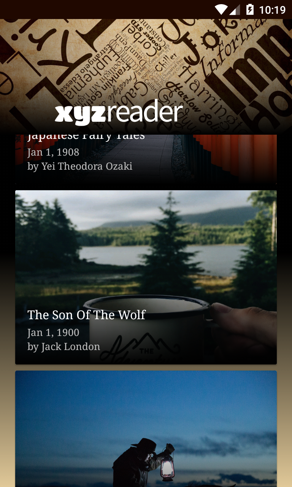
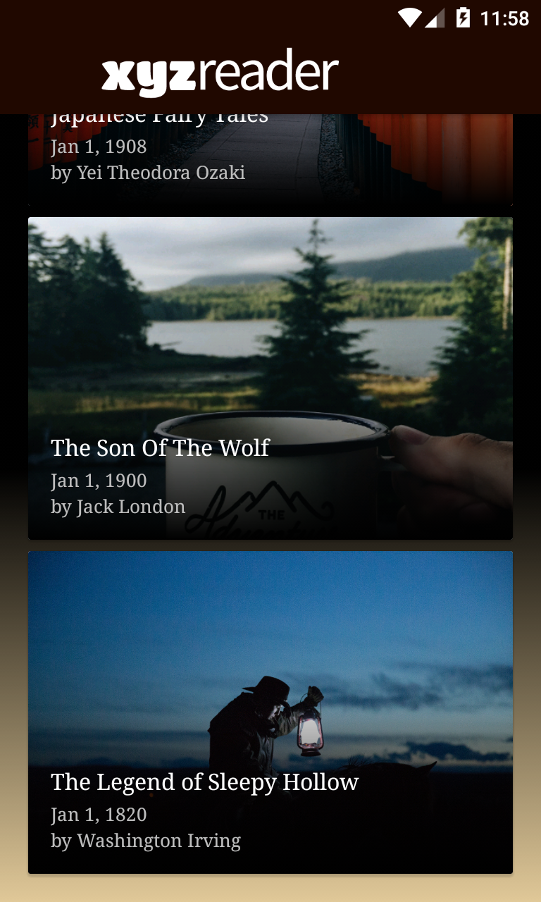
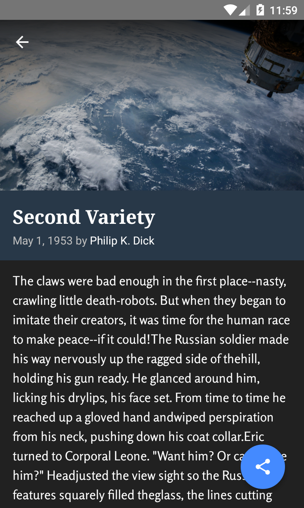
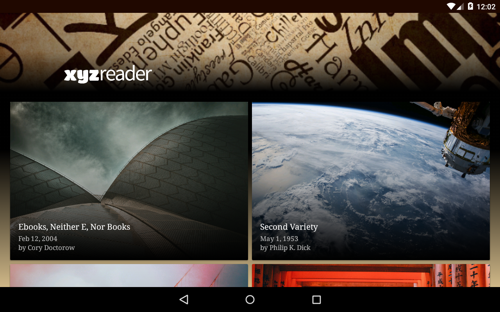
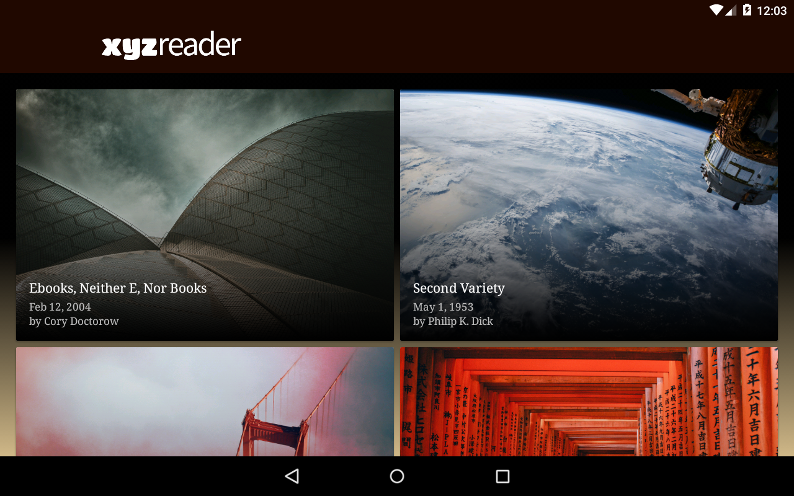
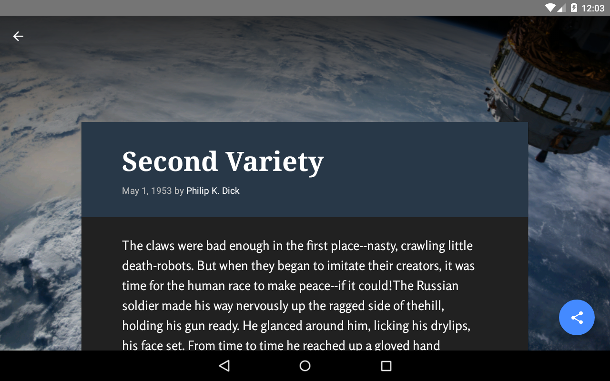

# XYZ Reader

App created for Udacity.com in the course: Google Challenge Scholarship: Android Developer Nanodegree Program.
 
<i>Skill level</i>: <b>advanced</b>

In this project, I redesigned an app to follow the Material Design guidelines and translate a set of static design mocks to a living and breathing app.

The starting point for the this project was provided to me in the [course repository](https://github.com/udacity/xyz-reader-starter-code).

## Why this Project

This project gives to developer an opportunity to improve an app’s design, a vital skill for building apps users will love.
It also replicates a common developer task of updating and changing an app's design as new standards are released.

## What I Learned

* Understand the fundamentals of Android design.
* Apply Material Design guidelines to an mobile application.
* Separate an interface into surfaces.
* Effectively use transitions and motion.

# Rubric

### Required Components

* App uses the Design Support library and its provided widget types (FloatingActionButton, AppBarLayout, SnackBar, etc).
* App uses CoordinatorLayout for the main Activity.
* App theme extends from AppCompat.
* App uses an AppBar and associated Toolbars.
* App provides a Floating Action Button for the most common action(s).
* App properly specifies elevations for app bars, FABs, and other elements specified in the [Material Design specification](http://www.google.com/design/spec/material-design/introduction.html).
* App has a consistent color theme defined in styles.xml. Color theme does not impact usability of the app.
* App provides sufficient space between text and surrounding elements.
* App uses images that are high quality, specific, and full bleed.
* App uses fonts that are either the Android defaults, are complementary, and aren't otherwise distracting.
* App conforms to common standards found in the [Android Nanodegree General Project Guidelines](http://udacity.github.io/android-nanodegree-guidelines/core.html).

## Screenshots

<h3 align="left">Phone</h3>
  
  
  
<h3 align="left">Tablet</h3>
  
  
  

